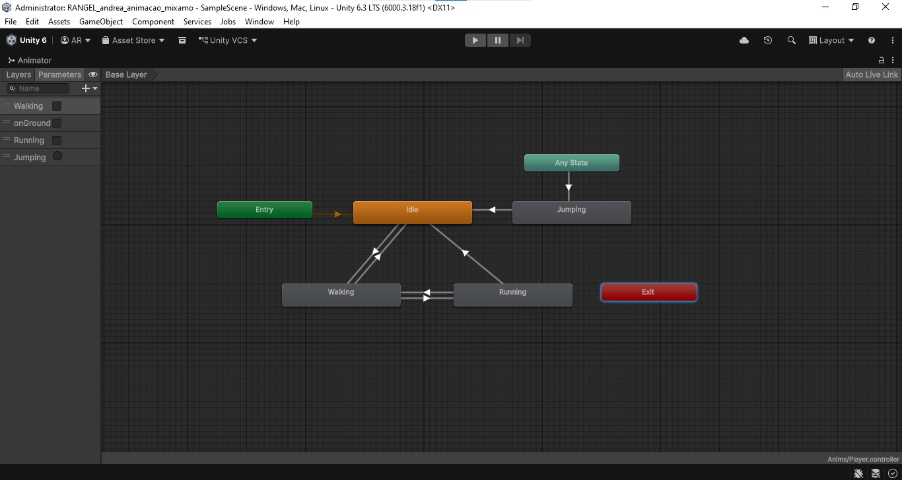
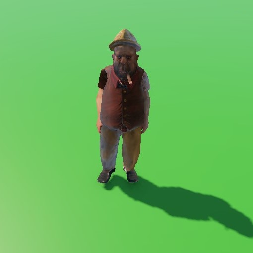
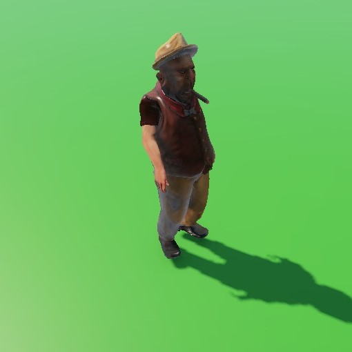

# Atividade Prática – Integração de Animações com Mixamo e Animator no Unity
**Curso:** Jogos Digitais  
**Disciplina:** Animação de Personagens 3D  
**Versão da Unity:** 6000.3.18f1

Projeto desenvolvido para a disciplina **Animação de Personagens 3D**, com foco na integração de animações obtidas através do Mixamo e na configuração de transições utilizando o sistema **Animator Controller** da Unity.

---

## Objetivo

Integrar animações de um personagem 3D utilizando o Mixamo e configurar um sistema de transições por meio do Animator, permitindo que as animações sejam executadas de acordo com as ações realizadas pelo jogador.

---

## Descrição da Implementação

Foi utilizado o personagem **The Boss**, obtido na plataforma Mixamo, juntamente com animações de movimentação e salto. As animações foram configuradas utilizando o sistema **Humanoid Avatar** da Unity e controladas por parâmetros no Animator Controller.

O projeto permite:

* Movimentação do personagem através do teclado;
* Transição entre caminhada e corrida;
* Execução de salto;
* Retorno automático para o estado adequado após o término da animação de salto.

---

## Tecnologias e Ferramentas Utilizadas

* Unity 6 (6000.3.18f1)
* C#
* Mixamo
* Animator Controller
* Character Controller
* Cinemachine

---

## Personagem Utilizado

| Personagem | Origem |
| ---------- | ------ |
| The Boss   | Mixamo |

---

## Animações Utilizadas

| Animação       | Função        |
| -------------- | ------------- |
| Breathing Idle | Estado parado |
| Walking        | Caminhada     |
| Running        | Corrida       |
| Jumping        | Salto         |

---

## Controles

| Ação                     | Teclas            |
| ------------------------ | ----------------- |
| Movimentação             | W, A, S, D        |
| Movimentação Alternativa | Setas Direcionais |
| Corrida                  | Shift             |
| Salto                    | Espaço (Space)    |

---

## Requisitos da Atividade

### Importação e Configuração

* [x] Importação do personagem The Boss
* [x] Importação da animação Breathing Idle
* [x] Importação da animação Walking
* [x] Importação da animação Running
* [x] Importação da animação Jumping
* [x] Configuração do Avatar Humanoid
* [x] Configuração do Character Controller

### Animator Controller

* [x] Criação do Animator Controller
* [x] Configuração do estado Idle
* [x] Configuração do estado Walking
* [x] Configuração do estado Running
* [x] Configuração do estado Jumping
* [x] Configuração das transições entre estados
* [x] Utilização de parâmetros para controle das animações

### Controle por Entrada

* [x] Walking ativado pelas teclas de movimentação
* [x] Running ativado pela tecla Shift
* [x] Jumping ativado pela tecla Space
* [x] Retorno automático para Walking ou Running após o salto

---

## Estrutura do Projeto

```text
Assets
├── Animations
├── Animator
├── Materials
├── Models
├── Prefabs
├── Scenes
├── Scripts
└── Settings
```

---

## Capturas de Tela

### Animator Controller

<p align="center">
  
</p>

### Cena do Projeto

<table align="center">
  <tr>
    <td align="center">
      <br>
      <b>Visão fontal do personagem</b>
    </td>
    <td align="center">
      <br>
      <b>Visão lateral do personagem</b>
    </td>
  </tr>
</table>

---

## Demonstração

### Gameplay

* Caminhada
* Corrida
* Salto
* Retorno automático para o estado correto

<p align="center">
  
</p>

---

## Conceitos Aplicados

* Importação de personagens e animações do Mixamo
* Configuração de Avatar Humanoid
* Animator Controller
* Estados e Transições
* Parameters (Bool, Float e Trigger)
* Character Controller
* Controle de movimentação via teclado
* Integração entre lógica de programação e sistema de animação

---

## Resultado

O projeto atende aos requisitos propostos na atividade prática, implementando um sistema funcional de animações controladas por teclado, com transições entre caminhada, corrida e salto utilizando o Animator Controller da Unity.

---

## Disciplina

**Animação de Personagens 3D**

---

## Desenvolvido por

**Andréa Rangel**
